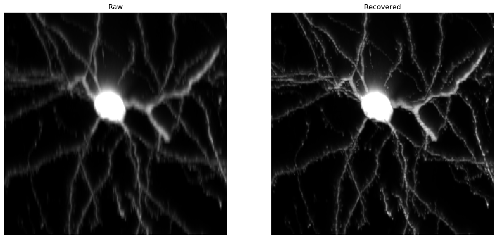

# SSAI-3D: System- and Sample-agnostic Isotropic 3D Microscopy

<!--  -->

## Overview

This repository provides the implementation and resources for [SSAI-3D](https://arxiv.org/abs/2406.06337), a deep learning framework for achieving high-fidelity isotropic 3D resolution recovery in microscopy. SSAI-3D is a weakly physics-informed, domain-shift-resistant framework demonstrated across diverse microscopy system and a wide array of 3D biological samples.


---

## System Requirements

### Software Requirements

#### Primary Dependencies

```python
python 3.9.5
pytorch 1.11.0
cuda 11.3
```

### Hardware Requirements

- NVIDIA RTX 3080 GPU is recommended.

Note: It is advisable to utilize a system with at least 16 GB of RAM for optimal performance.

--- 

## Installation Guide

Typical installation time on a desktop computer is estimated to be around 10 minutes.

### Setup Instructions

To install the necessary dependencies and set up the environment, execute the following commands:

```
pip install -r requirements.txt
python setup.py develop --no_cuda_ext
```

---
## Demonstration 

This demonstration is organized into three sections:

> **1. Fine-tuning Example (`./demo/demo_train.ipynb`)**
> - This notebook demonstrates sparse fine-tuning of a pre-trained network and inference with axial deblurring on an arbitrary 3D image stack.

> **2. Testing Example (`./demo/demo_test.ipynb`)**  
> - This notebook performs inference using a sparsely fine-tuned network on a given neuron dataset. Note that the pre-trained network should be fine-tuned for each dataset. This notebook is intended for quick testing purposes to save time on fine-tuning.

> **3. Generalizable Model Testing Example (`./demo/demo_generalizable.ipynb`)**
> - This notebook performs inference using a generalizable model fine-tuned with multiple 3D datasets. Note that for optimal performance, the pre-trained network should be fine-tuned for each specific dataset. This notebook is intended for quick testing to save time on fine-tuning.

---

### 1. Fine-tuning Example (`./demo/demo_train.ipynb`)

#### Data Preparation

- For all usages, please prepare your data in tiff format, with shape `(depth, width, height)`.

- Move your single-stack 3D dataset to `~/SSAI-3D/demo`. For example, it can be [mouse brain neurons](https://drive.google.com/file/d/1p3CUWhaSJXAA_9k8p4nRrhjBmbegQ-vJ/view?usp=sharing) or [mouse liver](https://www.nature.com/articles/s41592-018-0216-7#data-availability).

#### Pre-trained Model Checkpoints

- Download the [pre-trained model](https://drive.google.com/file/d/14D4V4raNYIOhETfcuuLI3bGLB-OYIv6X/view) and place the file in ```~/SSAI-3D/demo/experiments/pretrained_models```.
  
- **[Optional]** For applications requiring denoising, put the denoising model under the same directory. For example, we have trained a [denoising model](https://drive.google.com/file/d/1Lkg5a8xtjze7cKitdMl8bIY38cLAIojT/view?usp=sharing) using self-owned data.

#### Expected Outcomes

The results using example datasets from [mouse brain neurons](https://drive.google.com/file/d/1p3CUWhaSJXAA_9k8p4nRrhjBmbegQ-vJ/view?usp=sharing) and [mouse liver](https://www.nature.com/articles/s41592-018-0216-7#data-availability) are copied below.




#### Estimated Runtime

Typical runtime for resolution restoration on a standard desktop computer is approximately **30 minutes**. For quick testing purposes, please refer to the following two notebooks.

---

### 2. Testing Example (`./demo/demo_test.ipynb`)


#### Data Preparation

- Download the required anisotropic raw dataset from [this link](https://drive.google.com/file/d/1p3CUWhaSJXAA_9k8p4nRrhjBmbegQ-vJ/view?usp=sharing) and place it in `~/SSAI-3D/demo`.

#### Fine-tuned Model Checkpoints

- Download the fine-tuned model [here](https://drive.google.com/file/d/1Q3d7y96dQsd3Xk4l8c05M2VnUlu9q9CL/view?usp=sharing) and save it in ```~/SSAI-3D/demo/experiments/demo_neurons```


#### Estimated Runtime
Typical runtime for the testing notebook is ~5 minutes. Since SSAI-3D is optimized for fine-tuning on specific 3D volumes, users seeking a more generalizable model should refer to the next section: **3. Generalizable Model Testing Example**.

---


### 3. Generalizable Model Testing Example (`./demo/demo_generalizable.ipynb`)
 


#### Data Preparation

- Prepare your own 3D volumetric data in the shape `(depth, width, height)`.

#### Fine-tuned Model Checkpoints

- Download the generalizable pre-trained, fine-tuned model from [this link](https://drive.google.com/file/d/1mhpZ00h3UvXvTfsA_feYd1B2sWD-06uY/view). Place the model in ```./experiments/pretrained_models```

#### Estimated Runtime
Typical runtime for the testing notebook is ~5 minutes. However, since SSAI-3D is optimized for fine-tuning on specific 3D volumes, we recommend referring to  **1. Fine-tuning Example** for optimal performance.

---
This guide will help you maximize the performance of SSAI-3D for fine-tuning, testing, and application to diverse fluorescence microscopy datasets. For optimal results with new data, consider performing fine-tuning as described in **1. Fine-tuning Example** above.
